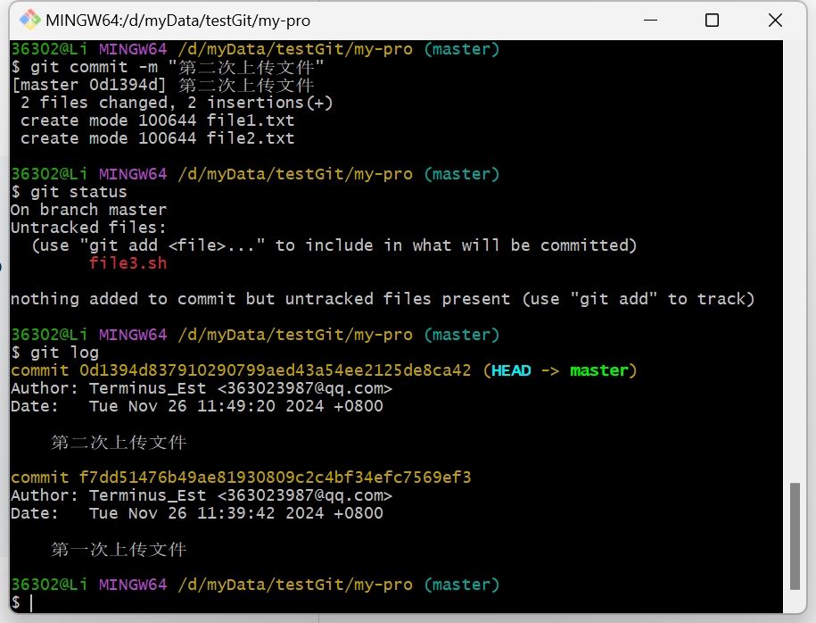

# 仓库描述
个人学习进度记录的仓库,只存储相关的代码和笔记相关的插图
# 进度记录
- 2024年11月25日
  - Git的基本使用和工作模式
# 文件目录结构
```
StudyNotes
|   .gitignore
|   README.md
|
\---image
    \---git
            gitInit创建仓库.png
            上传文件.png
            创建并查看文件.png
            多次创建并添加文件.png
            添加文件到暂存区.png
            第二次提交状态.png
```
# 相关学习内容笔记
## Git介绍
### Git介绍
Git是一个分布式版本控制系统使用仓库数据库跟踪每个文件的修改和变动记录,通过Git可以对文件进行更新恢复回退等功能,是一个高效的多用户合作管理项目工具

Git的使用方式:
- 命令行
- IDE插件
- 图形化界面

### Git初始化配置
git为了区分Linux相关的命令所有的命令都以git开头,使用git要先配置用户名和邮箱来区分提交的人是谁,使用一下几个命令来进行配置
```git
//配置用户名
git config --global user.name "test my"
//配置邮箱
git config --gloabl user.email "123456@qq.com"
//自动输入密码
git config --global credential.helper store
//显示该仓库的配置信息
git config --global --list
```
其中关于`--gloabl`是为了区分配置信息的作用范围:
- local 只作用于当前仓库
- global 作用于所有仓库
- system 作用于所有用户

### Git创建仓库
Git创建仓库分为两种创建方式：
- 本地创建之后关联到远程仓库
- 在远程仓库创建好之后克隆到本地仓库

在本地创建git仓库,使用`git init`命令直接在当前目录下创建,命令执行之后会出现一个`.git`文件夹,这个文件夹内部的所有数据就是记录仓库所有修改的历史
```git
//使用git init在当前目录下创建
git init
//使用git init <dirName> 在当前目录下新建一个仓库并创建
git init testGit
```
成功创建仓库之后会有创建成功的命令行提示

同时在文件夹中会出现一个隐藏文件,用来记录所有仓库数据库的内容

还有一种使用`git clone <url>`直接从网上的仓库克隆下来
### Git的工作区域和文件状态
Git的工作区域分为三个部分:
- 工作目录
- 暂存区
- 本地仓库  

这三个部分就像工厂的车间一样:
1. 所有文件的修改\创建\删除都在工作目录进行;
2. 当对文件进行了操作之后就把操作过的文件放到暂存区;
3. 当对所有的文件都修改完毕之后统一将缓存区域的数据送到本地仓库

Git的文件状态分为四种
- 未跟踪`新创建的文件`
- 未修改`已经在暂存区但是没有进行修改`
- 已修改`与暂存区的文件相比有修改`
- 已暂存`将所有修改后的文件放到暂存准备送到仓库`

其中文件状态的交换对应命令或操作如下的流程:
- 未跟踪→未修改 `git add`
- 未修改→已修改 `修改了文件`
- 已修改→已暂存 `git add`
- 未跟踪→已暂存 `git add`
- 未修改→未跟踪 `git rm`
- 已暂存→未修改 `git commit`
- 已修改→未修改 `git checkout`
- 已暂存→已修改 `git reset`

### 添加和提交文件
git中使用`git add <fileName>`向暂存区添加文件,使用`git commit -m <提交信息>`从暂存区向本地仓库提交文件,使用`git status`查看暂存区的状态

```bash
# 使用echo创建一个file1.txt文件,并将文件并查看文件的状态
echo "file1">file1.txt
git status
```

从图片中可以看出已经创建了file.txt文件并且提示可以通过`git add`将文件添加到暂存区并提交

```bash
# 使用git add将文件添加到暂存区并查看文件状态
git add text.txt
git status
```

从图片中可以看出添加的文件被标记为绿色并且提示可以使用`git rm --cached <file>`将文件从暂存区删除,也可以使用`git commit -m "<上传数据信息注释>"`将数据上传到本地仓库


```bash
# 使用git commit 将暂存区数据上传到本地仓库,使用git log查看上传日志
git commit -m "第一次上传"
git log
```


没有添加到暂存区的文件是不会被提交到本地仓库中的
```bash
# 创建多个文件,并且对部分文件添加到暂存区,查看文件状态
echo "file1">file1.txt
...
git add *.txt
git status
```

根据途中显示的结果可以看到只有被表达式匹配到的文件添加到了文件暂存区,没有被匹配到的还是未跟踪状态,此时将添加到的文件进行提交

可以看到第二次已经提交成功了但是仍旧显示`.sh`后缀的文件没有被跟踪 `提交只提交暂存区的文件`
### 版本回退
Git的版本回退有三种模式分别是:
- git reset --soft 保留回退版本的工作区和暂存区
- git reset --hard 删除回退版本的工作区和暂存区
- git reset --mixed 删除暂存区保存工作区的内容

### 查看仓库差异
git查看文件或者版本之间的差异使用`git diff`命令进行查看,但是只在没有图形化界面的状态下才会使用,一般都使用插件的形式图形化的去看差异
```bash
# 工作区和暂存区的差异
git diff
# 工作区+暂存区和本地仓库的差异
git diff HEAD
# 暂存区和本地仓库的差异
git diff --cached
# 前n个版本和当前版本的差异
git diff HEAD~n HEAD
# 分支之间的差异
git diff <branch_name> <branch_name>
```
### 删除文件
当想要把某个文件从仓库中删除有两种办法分别是:
- 在本地文件中直接删除这个文件同时将删除之后的文件进行提交
- 使用`git rm`命令直接删除想要删除的文件然后提交
- 如果只删除暂存区添加`--cached`

### 添加忽略跟踪文件
版本库中有一些中间文件\生成文件\配置信息\用户信息\日志文件等一些文件并不希望被添加到库中被追踪,这个时候通过`.gitignore`文件来设置要忽略的文件,如果文件已经被添加到了版本库中就先删除文件提交之后才会生效,忽略文件在暂存区和工作区就已经开始生效了,使用`git status`的时候会根据这个忽略文件来屏蔽跟踪的文件夹

GitHub中提供了一些[模板](https://github.com/github/gitignore)可以在创建仓库的时候使用,文件的匹配规则:
- 空行或者以#开头的行会被Git忽略.一般空行用于可读性分割/#用于注释信息
- 使用标准的Blob模式匹配,例如:
  - *通配任意个字符
  - ?匹配单个字符
  - []表示匹配列表内的字符
  - 两个**代表匹配任意中间目录
  - 中括号短连接线表示范围内的所有数字例如:
    - [0-9],[a-z]

### 生成ssh密钥和关联仓库
使用命令`ssh-keygen -t rsa -b 4096`来生成一对公钥和私钥,其中有`.pub`后缀的是公钥,而没有后缀的是私钥

使用命令`git remote add <远程仓库别名> <远程仓库地址>`或者`git push -u <远程仓库名> <分支名字>`来添加一个远程仓库
使用命令`git remote -v` 查看远程仓库
使用命令`git pull <远程仓库名><远程分支名>:<本地分支命>`来拉取一个远程仓库

### 分支相关的简单操作
查看分支列表: git branch
创建分支: git branch branch-name
切换分支: git switch branch-name
合并分支: git merge branch-name
删除分支: git branch -d branch-name 删除已经合并的分支
         git branch -D branch-name 删除未合并的分支

### 分支合并冲突解决
当两个分支中的修改都出现在同一个文件的同一个位置,Git无法自动合并文件就会出现版本冲突,这个时候的解决方法:
1. 手动修改解决自动合并失败的冲突文件
2. 将修改之后的文件添加到暂存区
3. 将修改后的内容进行提交
4. 如果想要中止合并:git merge --abort

### 变基和回退
git可以通过使用rebase命令来将两个分支合并为一个线性的历史记录